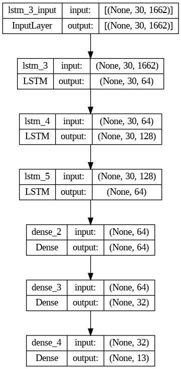

# Sign Language Detection

This project is part of a Computer Vision (CV) course and focuses on sign language detection using mediapipe models and LSTM.

## Table of Contents

- [Introduction](#introduction)
- [Installation](#installation)
- [Usage](#usage)
- [Project Structure](#project-structure)
- [Dataset](#dataset)
- [Model Architecture](#Model-Architecture)
- [Demo](#demo)

## Introduction

The goal of this project is to build a system that can recognize sign language gestures from video input. This is achieved using a trained machine learning model that processes video frames to identify and classify gestures.

## Installation

1. Clone the repository:

   ```bash
   git clone https://github.com/Samer-Ramses/sign-language.git
   cd sign-language

   ```

2. Install the required dependencies:
   ```bash
   pip install -r requirements.txt
   ```

## Usage

1. Ensure you have the necessary data files. You can download the dataset from the provided links or use your own.
2. Run the Jupyter notebook to train the model or make predictions:
   ```bash
   jupyter notebook code.ipynb
   ```
3. To see a demo, play the `demo.mp4` file which showcases the sign language detection in action.

## Project Structure

- `code.ipynb`: Jupyter notebook containing the code for training and testing the model.
- `model.p`: Serialized model file.
- `MP_Data.rar`: Dataset containing video frames of sign language gestures.
- `action.h5`: Trained model weights.
- `demo.mp4`: Demo video demonstrating the functionality of the model.
- `requirements.txt`: List of dependencies required to run the project.
- `architecture.png`: Image that represent the model architecture.

## Dataset

The dataset used for this project consists of video frames of different sign language gestures. It is stored in `MP_Data.rar`. Make sure to extract it before training the model.

## Model Architecture

[]("architecture")

## Demo

A demonstration of the sign language detection can be viewed in `demo.mp4`. This video shows the model predicting sign language gestures in real-time.
